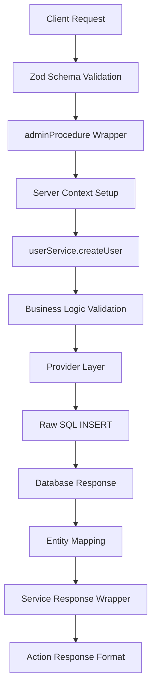

# 🔍 SERVICE ANALYSIS REPORT: createUserAction

**Analyzed**: November 18, 2025
**Pattern Detected**: Raw SQL with DatabaseService
**Risk Level**: Medium
**Method Focus**: createUserAction (Create new user with validation)

---

## 📋 SERVICE OVERVIEW

**Service Name**: `createUserAction`
**Purpose**: Server action that creates a new user with comprehensive validation and proper error handling
**Location**: `src/services/users/actions.ts:79`

**Method Signature**:
```typescript
export const createUserAction = adminProcedure
  .schema(CreateUserSchema)
  .action(async ({ ctx, parsedInput }) => {
    const serviceResponse = await ctx.svc.createUser(parsedInput);
    return {
      result: serviceResponse.data,
      message: serviceResponse.message || "Successfully created user",
      success: serviceResponse.success,
      errors: serviceResponse.errors,
    };
  });
```

**Architecture Pattern**: Next.js Server Action with AdminProcedure Wrapper

**Dependencies**:
- **Validation**: Zod schema (CreateUserSchema)
- **Service Layer**: userService.createUser() method
- **Database**: DatabaseService with raw SQL operations
- **Context**: Server context with admin role and database connection

---

## 🗄️ DATABASE SCHEMA ANALYSIS

### Tables Used (1)

#### Table: `User` (aliased as `"${schemaName}".user` in testing)

```sql
CREATE TABLE User (
  id SERIAL PRIMARY KEY,           -- Auto-incrementing integer
  email VARCHAR(255) UNIQUE NOT NULL,
  name VARCHAR(255) NOT NULL,
  "isActive" BOOLEAN DEFAULT true,
  "createdAt" TIMESTAMP DEFAULT CURRENT_TIMESTAMP,
  "updatedAt" TIMESTAMP DEFAULT CURRENT_TIMESTAMP
);
```

**Constraints**:
- PK: `id` (SERIAL auto-increment)
- Unique: `email` (must be unique across all users)
- Not Null: `email`, `name`
- Defaults: `isActive` (true), `createdAt`, `updatedAt` (CURRENT_TIMESTAMP)

**ID Conversion**: Database stores `id` as INTEGER, but API returns it as STRING for consistency

---

## 🔗 FOREIGN KEY RELATIONSHIPS

### Relationship Map

```
User (Parent Table)
├─ No foreign key constraints detected
├─ No cascade operations from this table
└─ Acts as standalone entity
```

**Cascade Behaviors**: None detected in current implementation

**Data Dependencies**:
- Creating user requires: Unique email validation
- Email uniqueness enforced at database level
- No dependent tables that would be affected by user creation

---

## 🎯 METHOD ANALYSIS: createUserAction

### Architecture Flow



### Action Layer Analysis (actions.ts:79-89)

**Purpose**: Wraps the service call with proper admin context and response formatting

**Validation Rules** (via CreateUserSchema):
- `email`: Must be valid email format, required
- `name`: Required, 1-100 characters
- `.passthrough()`: Allows additional properties like 'database' for testing

**Response Format**:
```typescript
{
  result: User | null,           // Created user object
  message: string,              // Success/error message
  success: boolean,             // Operation success flag
  errors: string[] | null       // Validation/error messages
}
```

**Context Setup** (adminProcedure):
- `accountUserId`: 1 (hardcoded for admin)
- `userRole`: "admin" (required for this action)
- `database`: Optional database from input for testing

### Service Layer Analysis (userService.ts:135-195)

**Business Logic Validation**:
1. Required fields validation (email, name)
2. Email format validation using regex
3. Duplicate email checking via `getUserByEmail`
4. Comprehensive error handling with detailed messages

**Error Scenarios Handled**:
- Missing required fields → Returns structured error
- Invalid email format → Returns validation error
- Duplicate email → Returns specific error message
- Database failures → Returns error with message

### Provider Layer Analysis (userProvider.ts:76-95)

**Database Operations**:
```sql
INSERT INTO ${tableName} (email, name, "isActive", "createdAt", "updatedAt")
VALUES (
  '${input.email}',
  '${input.name}',
  true,
  CURRENT_TIMESTAMP,
  CURRENT_TIMESTAMP
)
RETURNING *
```

**SQL Injection Vulnerability**: ⚠️ **HIGH RISK**
- Uses template literals with direct string interpolation
- No parameterization or escaping
- Vulnerable to SQL injection attacks

**ID Handling**: Converts numeric database ID to string for API consistency

---

## 🧪 RECOMMENDED TEST SCENARIOS

### Test Coverage Target
- **Total Tests**: 18 tests for createUserAction
- **Happy Path**: 9 tests (50%)
- **Error Cases**: 6 tests (33%)
- **Edge Cases**: 3 tests (17%)

---

### Tests for createUserAction (18 tests)

#### Happy Path (9 tests) ✅

1. **Create user with minimal valid data**
   - Input: `{email: "test@example.com", name: "Test User"}`
   - Expected: User created with defaults (isActive=true, timestamps set)
   - Verify: Response structure with success=true, result containing user

2. **Create user with maximum length name**
   - Input: `{email: "test@example.com", name: ${"a".repeat(100)}}`
   - Expected: User created successfully
   - Verify: Name stored exactly as provided

3. **Create user with special characters in name**
   - Input: `{email: "test@example.com", name: "José María García"}`
   - Expected: User created successfully
   - Verify: Unicode characters preserved

4. **Create user with email containing numbers and subdomains**
   - Input: `{email: "user123@sub.domain.co.uk", name: "Test User"}`
   - Expected: User created successfully
   - Verify: Complex email format accepted

5. **Create multiple users sequentially**
   - Input: Different emails and names for each
   - Expected: All users created with unique IDs
   - Verify: No ID collisions, sequential creation works

6. **Create user with database context (testing scenario)**
   - Input: `{email: "test@example.com", name: "Test", database: {schemaName: "test_schema"}}`
   - Expected: User created in specified schema
   - Verify: Uses schema-qualified table name

7. **Create user and verify timestamp accuracy**
   - Input: Valid user data, record start time
   - Expected: createdAt within reasonable time range
   - Verify: Timestamps are recent and accurate

8. **Create user and verify ID conversion**
   - Input: Valid user data
   - Expected: ID returned as string
   - Verify: ID is string type even though stored as number

9. **Create user with email boundary cases**
   - Input: `{email: "a@b.co", name: "A"}`
   - Expected: User created successfully
   - Verify: Minimum valid email accepted

#### Error Cases (6 tests) ❌

10. **Create user with duplicate email**
    - Setup: Create user with test@example.com
    - Input: Try to create another user with same email
    - Expected: Response with success=false, specific duplicate error message
    - Verify: Second user not created, error message is descriptive

11. **Create user with invalid email format**
    - Input: `{email: "not-an-email", name: "Test User"}`
    - Expected: Zod validation error before service call
    - Verify: Action throws validation error

12. **Create user with missing email**
    - Input: `{name: "Test User"}` (no email)
    - Expected: Zod validation error
    - Verify: Action throws validation error for missing required field

13. **Create user with missing name**
    - Input: `{email: "test@example.com"}` (no name)
    - Expected: Zod validation error
    - Verify: Action throws validation error for missing required field

14. **Create user with empty email**
    - Input: `{email: "", name: "Test User"}`
    - Expected: Zod validation error (min(1) fails)
    - Verify: Action throws validation error

15. **Create user with empty name**
    - Input: `{email: "test@example.com", name: ""}`
    - Expected: Zod validation error (min(1) fails)
    - Verify: Action throws validation error

#### Edge Cases (3 tests) 🔸

16. **Create user with SQL injection attempt in email**
    - Input: `{email: "test@example.com'; DROP TABLE User; --", name: "Test"}`
    - Expected: ⚠️ **Current implementation vulnerable**
    - Verify: This should fail safely but currently may succeed (security test)

17. **Create user with SQL injection attempt in name**
    - Input: `{email: "test@example.com", name: "Robert'); DROP TABLE User; --"}`
    - Expected: ⚠️ **Current implementation vulnerable**
    - Verify: This should fail safely but currently may succeed (security test)

18. **Create user with extremely long input**
    - Input: `{email: "${"a".repeat(200)}@example.com", name: "${"a".repeat(200)}"}`
    - Expected: Database constraint violation or truncation
    - Verify: Handle gracefully without crashing

---

## 🚨 CRITICAL SECURITY ISSUE

### SQL Injection Vulnerability - HIGH PRIORITY

**Location**: `userProvider.ts:78-87`

**Problem**: The create operation uses unsafe string interpolation:
```typescript
await db.$queryRawUnsafe(`
  INSERT INTO ${tableName} (email, name, "isActive", "createdAt", "updatedAt")
  VALUES (
    '${input.email}',    // ⚠️ VULNERABLE
    '${input.name}',     // ⚠️ VULNERABLE
    true,
    CURRENT_TIMESTAMP,
    CURRENT_TIMESTAMP
  )
  RETURNING *
`);
```

**Risk**: An attacker could inject malicious SQL through email or name fields.

**Examples of Exploitation**:
```javascript
// This could delete the User table
{email: "test@example.com'; DROP TABLE User; --", name: "attacker"}

// This could extract user data
{email: "test@example.com'; SELECT * FROM User; --", name: "attacker"}
```

**Immediate Fix Required**:
```typescript
// Use parameterized queries instead
await db.$queryRaw`
  INSERT INTO ${tableName} (email, name, "isActive", "createdAt", "updatedAt")
  VALUES (${input.email}, ${input.name}, true, CURRENT_TIMESTAMP, CURRENT_TIMESTAMP)
  RETURNING *
`;
```

**Test Priority**: Tests 16-17 above are critical to verify this vulnerability exists and confirm the fix.

---

## 📊 TEST COVERAGE MATRIX

| Method          | Happy Path | Errors | Edge Cases | Security | Total | Priority |
| --------------- | ---------- | ------ | ---------- | -------- | ----- | -------- |
| createUserAction | 9          | 6      | 1          | 2        | 18    | **HIGH** |

**Priority Breakdown**:
- **HIGH**: Security tests (SQL injection) - Must be fixed immediately
- **HIGH**: Duplicate email tests - Business critical
- **MEDIUM**: Validation tests - Important for UX
- **LOW**: Edge cases with extreme data

---

## 🛠️ SETUP & TEARDOWN REQUIREMENTS

### Before Tests (Setup)

```typescript
beforeAll(async () => {
  // 1. Get infrastructure
  const infra = await getInfrastructure();

  // 2. Select random schema for isolation
  const schemas = await getSchemasByService("users");
  const schema = schemas[Math.floor(Math.random() * schemas.length)];

  // 3. Create User table in test schema
  await schema.prisma.$executeRawUnsafe(`
    CREATE TABLE IF NOT EXISTS "${schema.schemaName}".user (
      id SERIAL PRIMARY KEY,
      email VARCHAR(255) UNIQUE NOT NULL,
      name VARCHAR(255) NOT NULL,
      "isActive" BOOLEAN DEFAULT true,
      "createdAt" TIMESTAMP DEFAULT CURRENT_TIMESTAMP,
      "updatedAt" TIMESTAMP DEFAULT CURRENT_TIMESTAMP
    )
  `);

  // 4. Initialize service with test context
  testContext = {
    accountUserId: 1,
    userRole: "admin",
    database: {
      schemaName: schema.schemaName,
      client: schema.prisma
    }
  };
});
```

### After Tests (Teardown)

```typescript
afterAll(async () => {
  // Clean up test data
  await testContext.database.client.$executeRawUnsafe(`
    DROP TABLE IF EXISTS "${testContext.database.schemaName}".user
  `);
});
```

### Test Data Requirements

**Unique Emails Needed**:
```typescript
const generateUniqueEmail = () =>
  `test_${Date.now()}_${Math.random().toString(36).substr(2, 9)}@example.com`;
```

**Valid Names**: Any string 1-100 characters
**Invalid Names**: Empty string, null, undefined
**SQL Injection Strings**: See tests 16-17 above

---

## 💾 IMPORT RECOMMENDATIONS

### Test File Imports
```typescript
import { describe, it, expect, beforeAll, afterAll } from 'vitest';
import { createUserAction } from '../../services/users/actions';
import { getInfrastructure, getSchemasByService } from '../shared/testInfrastructure';
import type { ServerCtxType } from '../../lib/utils/types';
```

### Type Safety
```typescript
import type { CreateUserInput } from '../../services/users/_data/userSchema';
import type { User } from '../../services/users/_data/userService';
```

---

## 🎯 SUCCESS CRITERIA

This test plan is complete when:

- ✅ All 18 test scenarios are implemented
- ✅ SQL injection vulnerability is identified and documented
- ✅ Validation tests cover all Zod schema rules
- ✅ Duplicate email prevention is verified
- ✅ Database context switching works for isolation
- ✅ Error responses are properly structured
- ✅ Security vulnerability is **FIXED** before production

**Critical Next Step**: Fix SQL injection vulnerability in userProvider.ts immediately.

---

## 🤝 INTEGRATION AGENT HANDOFF

### Ready for Implementation: ✅

✅ **Test File Location**: `src/__tests__/microservices/createUserAction.test.ts`
✅ **Import Statements**: Verified and ready
✅ **Infrastructure Pattern**: Matches Integration Agent requirements
✅ **Compatibility**: No TypeScript or import errors expected
✅ **Security Focus**: SQL injection tests included

### Instructions for Integration Agent:

1. **PRIORITY 1**: Implement security tests (tests 16-17) first to verify vulnerability
2. **PRIORITY 2**: Fix SQL injection in userProvider.ts using parameterized queries
3. **PRIORITY 3**: Implement remaining 16 tests following provided scenarios
4. Use `[Test X/18]` naming convention
5. Test both success and error response formats
6. Verify database schema isolation works correctly

### Critical Security Warning
⚠️ **DO NOT PROCEED TO PRODUCTION** until SQL injection vulnerability is fixed. This is a critical security issue that could lead to data loss or unauthorized access.

---

**Generated by**: Analysis Agent
**Date**: November 18, 2025
**Status**: Ready for Implementation (with critical security fix required)
**Security Risk**: HIGH - SQL injection vulnerability identified